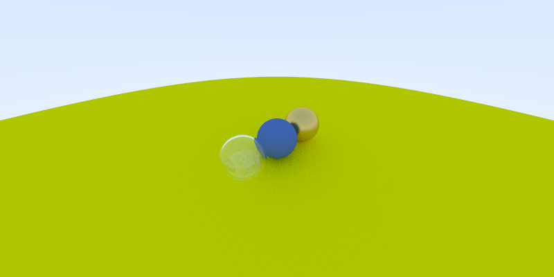
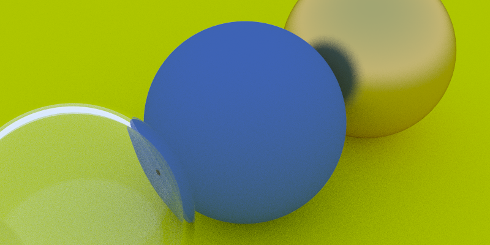
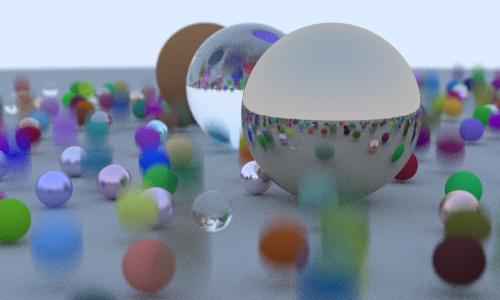
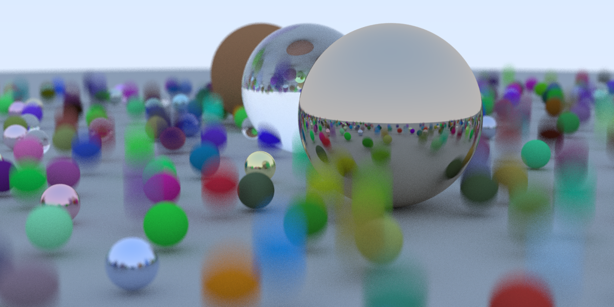
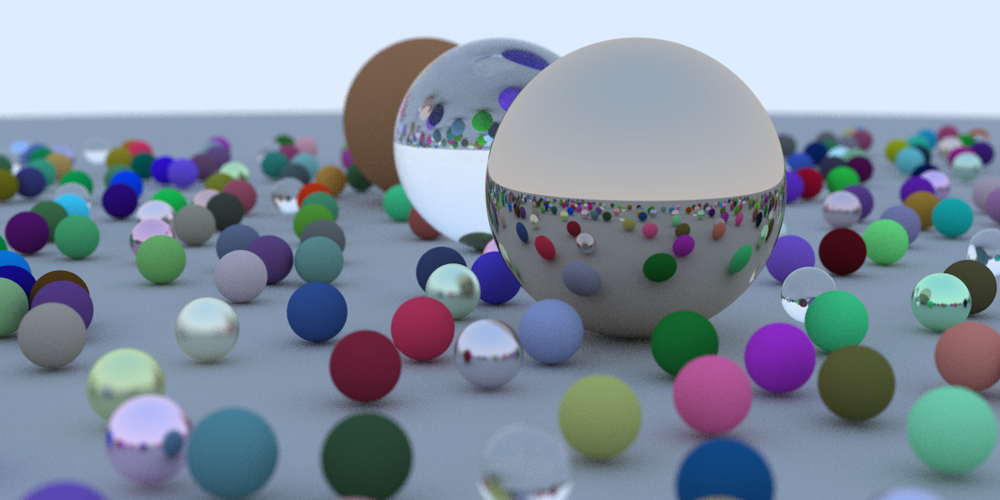
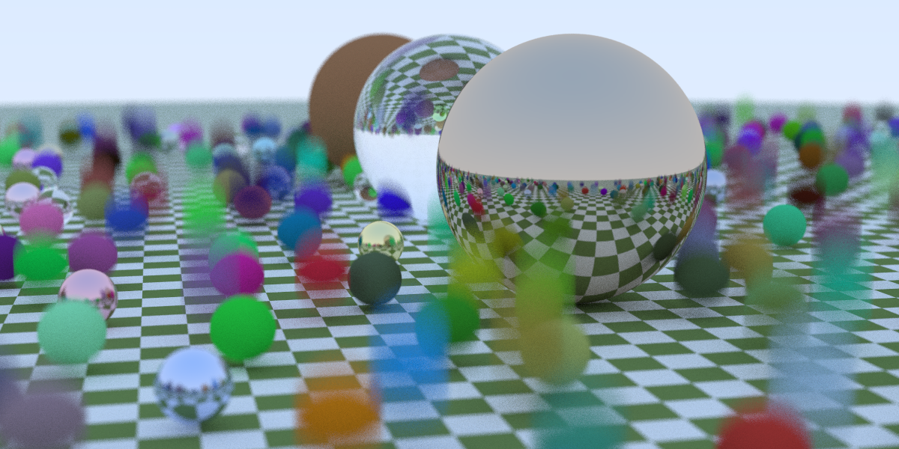

# Raytracing Series in Rust

Reference: https://raytracing.github.io

## Building and Running

Build debug profile:

```bash
cargo build
```

Build release profile (generally much faster):

```bash
cargo build --release
```

Build and run with default settings:

```bash
cargo run > image.ppm
```

Run compiled versions with default settings:

```bash
./target/debug/raytracing_series > image.ppm
```

```bash
./target/release/raytracing_series > image.ppm
```

Get help on program arguments:

```bash
cargo run -- --help
```

```bash
./target/debug/raytracing_series --help
```

```bash
./target/release/raytracing_series --help
```

## Images

Convert ppm to png using `sips`:

```bash
sips -s format png image.ppm --out image.png
```

### Raytracing in One Weekend

| Title              | Image                                                      | Title           | Image                                                |
| ------------------ | ---------------------------------------------------------- | --------------- | ---------------------------------------------------- |
| Lambertian Diffuse |  | Metal           |         |
| Dielectric         |          | Wide Angle Lens |    |
| Telephoto Lens     |           | Defocus Blur    |  |
| Final Image        |      |                 |                                                      |

### Raytracing The Next Week

| Title              | Image                                                      | Title                       | Image                                                   |
| ------------------ | ---------------------------------------------------------- | --------------------------- | ------------------------------------------------------- |
| Motion Blur        |         | Motion Blur w/ BVH          |  |
| Final Image w/ BVH |  | Solid &amp; Checker Texture |  |

#### Timing Benchmarks

Without Bounding Volume Hierarchy:

```bash
target/release/raytracing_series --scene random_spheres -w 1200 -h 600 \
    --seed 8589869056 > random_spheres.ppm

HittableList: 0.000042243 seconds
Done: 1960.7145 seconds
```

```bash
target/release/raytracing_series --scene motion_blur -w 1200 -h 600 \
    --seed 8589869056 > motion_blur.ppm

HittableList: 0.000036335 seconds
Done: 2201.2559 seconds
```

With Bounding Volume Hierarchy:

```bash
target/release/raytracing_series --scene random_spheres --bvh -w 1200 -h 600 \
    --seed 8589869056 > random_spheres_bvh.ppm

BVH: 0.000402492 seconds
Done: 824.07605 seconds
```

```bash
target/release/raytracing_series --scene motion_blur --bvh -w 1200 -h 600 \
    --seed 8589869056 > motion_blur_bvh.ppm

BVH: 0.000610622 seconds
Done: 913.7702 seconds
```
