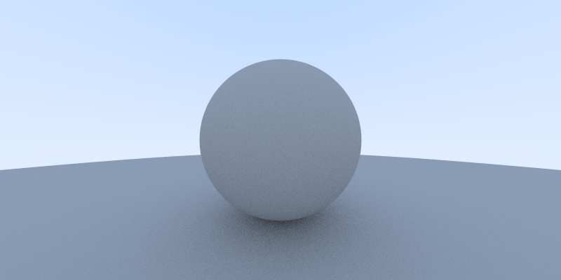
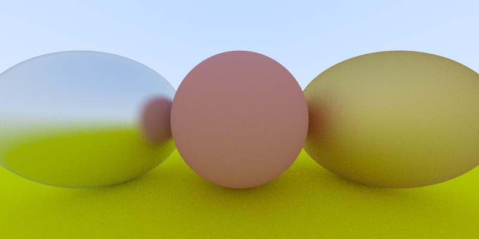
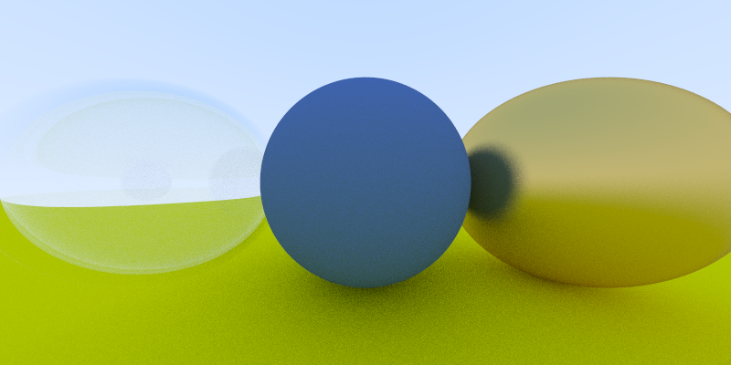
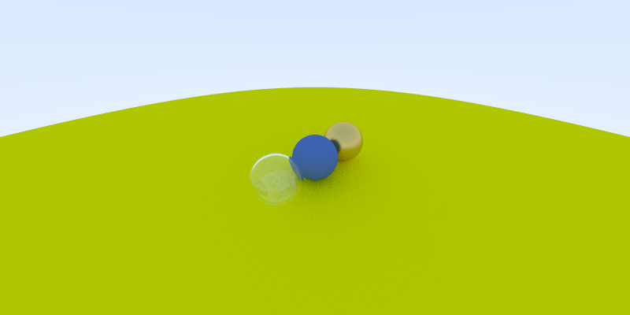
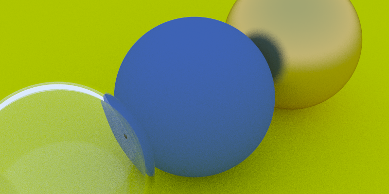
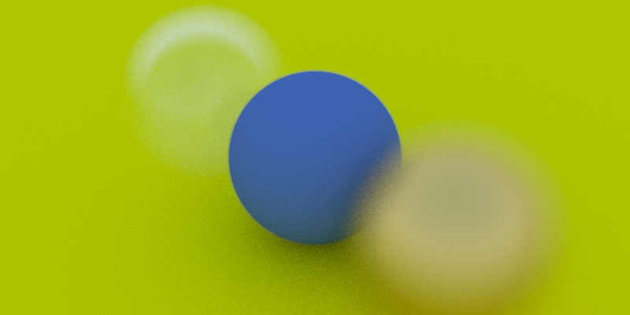
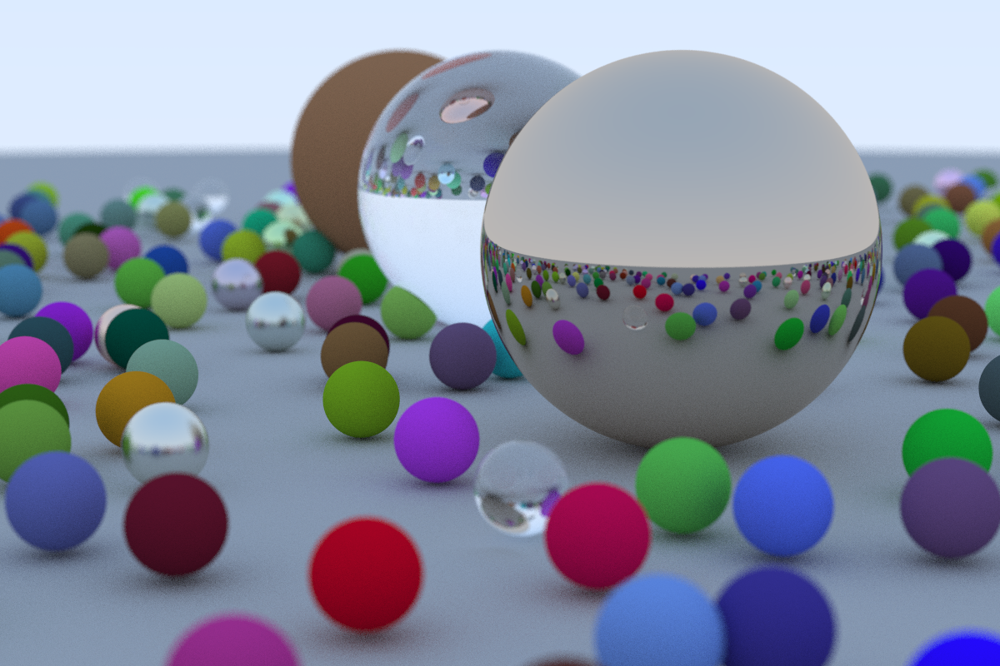

# Raytracing Series in Rust

Reference: https://raytracing.github.io

## Building and Running

Build debug profile:

```bash
cargo build
```

Build release profile (generally much faster):

```bash
cargo build --release
```

Build and run with default settings:

```bash
cargo run > image.ppm
```

Run compiled versions with default settings:

```bash
./target/debug/raytracing_series > image.ppm
```

```bash
./target/release/raytracing_series > image.ppm
```

Get help on program arguments:

```bash
cargo run -- --help
```

```bash
./target/debug/raytracing_series --help
```

```bash
./target/release/raytracing_series --help
```

## Images

Convert ppm to png using `sips`:

```bash
sips -s format png image.ppm --out image.png
```

### Raytracing in One Weekend








