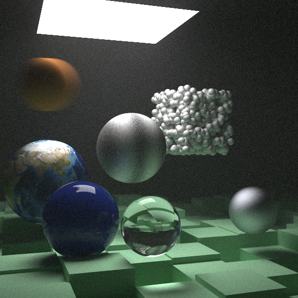
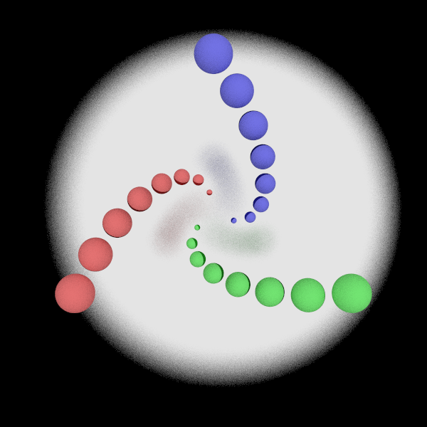
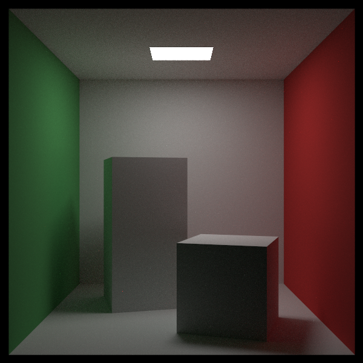
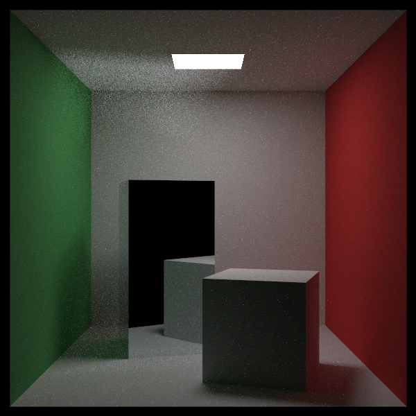
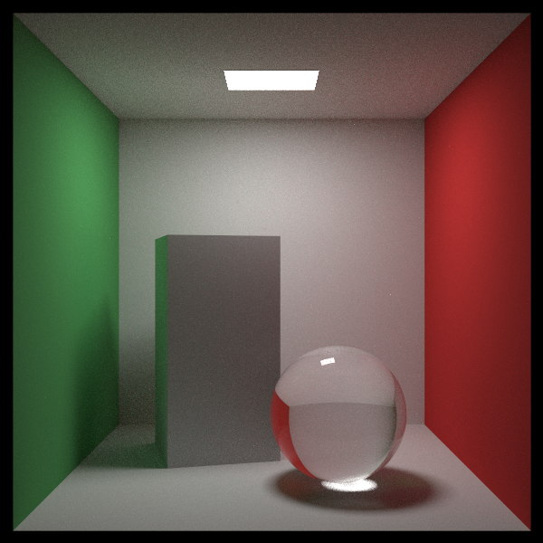

# Raytracing Series in Rust

Reference: https://raytracing.github.io

## Credits

- [NASA Visible Earth](https://visibleearth.nasa.gov/images/73909/december-blue-marble-next-generation-w-topography-and-bathymetry) for the image texture.

## Releases

Completed work from each book is tagged as a release which can be found
[here](https://github.com/hackmad/raytracing_series/releases).

The images shown below are based on those versions. Not all scenes are
available in each release and may look different due to changes in the
algorithms in successive books.

## Building and Running

Build debug profile. The executable will be `target/debug/raytracing_series`.

```bash
cargo build
```

Use `--release` when building/running for faster executable. The executable
will be `target/release/raytracing_series`.

```bash
cargo build --release
```

Run with program arguments (note that `--` is needed after arguments for cargo
and before program arguments can be supplied):

```bash
cargo run -- --scene cornell_box -w 1200 -h 600 -o image.png
```

```bash
./target/debug/raytracing_series --scene cornell_box -w 1200 -h 600 -o image.png
```

Get help on program arguments:

```bash
cargo run -- --help
```

```bash
./target/debug/raytracing_series --help
```

### Raytracing in One Weekend

| Title              | Image                                                     | Title           | Image                                               |
| ------------------ | --------------------------------------------------------- | --------------- | --------------------------------------------------- |
| Lambertian Diffuse |  | Metal           |         |
| Dielectric         |          | Wide Angle Lens |    |
| Telephoto Lens     |           | Defocus Blur    |  |
| Final Image        |   |                 |                                                     |

### Raytracing The Next Week

| Title                   | Image                                                        | Title                       | Image                                                  |
| ----------------------- | ------------------------------------------------------------ | --------------------------- | ------------------------------------------------------ |
| Motion Blur             |            | Motion Blur w/ BVH          |  |
| Final Image w/ BVH      |  | Solid &amp; Checker Texture |  |
| Checkered Spheres       |      | Perlin Noise Texture        |   |
| Earth Texture           |                  | XY Rectangle &amp; Lights   |     |
| Empty Cornell Box       |      | Standard Cornell Box        |      |
| Smoke and Fog           |          | Final Image                 |  |
| Rotation around X, Y, Z |         |                             |                                                        |

### Raytracing The Rest Of Your Life

| Title                | Image                                                          | Title                | Image                                                       |
| -------------------- | -------------------------------------------------------------- | -------------------- | ----------------------------------------------------------- |
| Standard Cornell Box |            | Specular Reflections |  |
| Final Image          |  |                      |                                                             |

#### Timing Benchmarks

##### Single-threaded

Without Bounding Volume Hierarchy:

```bash
target/release/raytracing_series --scene final_one_weekend -w 1200 -h 600 \
    --seed 8589869056 -t 1 -o final_one_weekend.png

HittableList: 0.000061101 seconds
Done: 28.45 minutes
```

With Bounding Volume Hierarchy:

```bash
target/release/raytracing_series --scene final_one_weekend  --bvh -w 1200 -h 600 \
    --seed 8589869056 -t 1 -o final_one_weekend_bvh.png

BVH: 0.000398774 seconds
Done: 9.33 minutese
```

##### Multi-threaded

Without Bounding Volume Hierarchy:

````bash
target/release/raytracing_series --scene final_one_weekend -w 1200 -h 600 \
    --seed 8589869056 -t 4 -o final_one_weekend.png

HittableList: 0.000035394 seconds
Done: 10.89 minutes
```

With Bounding Volume Hierarchy:

```bash
target/release/raytracing_series --scene final_one_weekend --bvh -w 1200 -h 600 \
    --seed 8589869056 -t 4 -o final_one_weekend_bvh.png

BVH: 0.000471452 seconds
Done: 5.14 minutese
````
